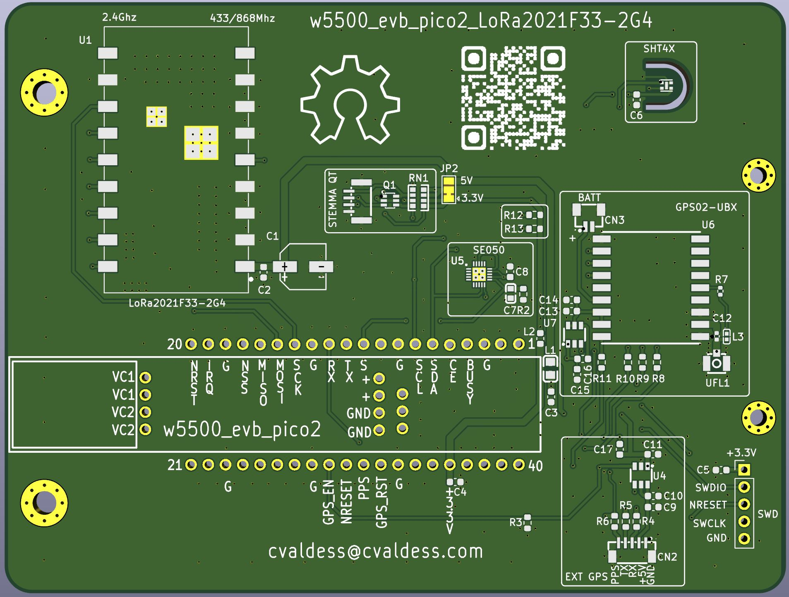
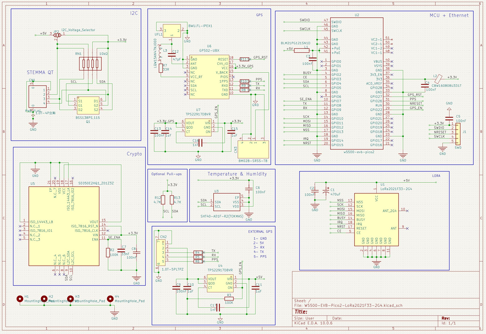
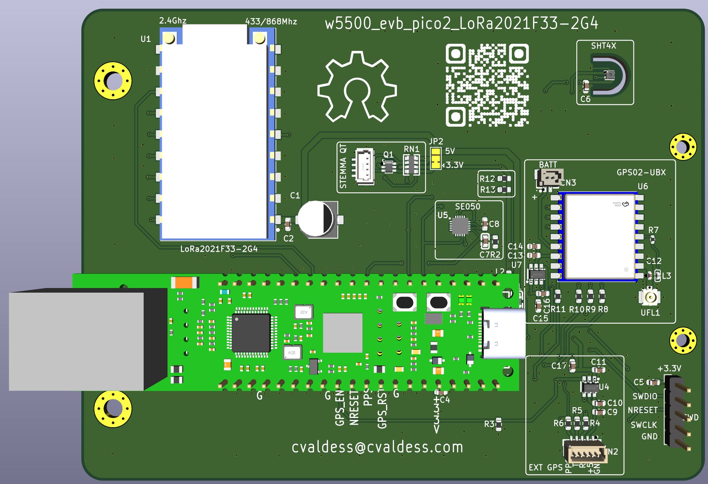

# w5500_evb_pico2_LoRa2021F33-2G4

A custom PCB carrier board built around the **WIZnet W5500-EVB-Pico2** (an RP2350 with an **on-board W5500 Ethernet** controller) and an **LoRa2021F33-2G4: 2W High-Power, High-Speed Multi-Band LR2021 Wireless Communication Module**, in a single compact design for Meshtastic applications, low-cost Ethernet MQTT Gateway and Reticulum transport node.

## Where to buy

Everything needed to build this board yourself is in this repository, under the GPL. If you would
rather skip the sourcing and the soldering, assembled units are available:

**[Buy an assembled board →](https://meshtastic.cvaldess.com/nmgnicerf)**  built, flashed and
tested before it ships. Ships from Spain to the EU.

Nothing is held back for the sale: the schematic, the bill of materials and the pin mapping are all
here, and the same design sent to any board house gives you the same board.

> Meshtastic is a trademark of Meshtastic LLC. This board is an independent design, not
> affiliated with or endorsed by Meshtastic LLC.

## License

This project is licensed under the [GNU General Public License v3.0](LICENSE).

## Author

**@cvaldess** — [cvaldess@cvaldess.com](mailto:cvaldess@cvaldess.com) - [meshtastic.cvaldess.com](https://meshtastic.cvaldess.com)

## Features

- **WIZnet W5500-EVB-Pico2** — RP2350-based microcontroller with dual-core Arm Cortex-M33 / RISC-V and an **on-board W5500** hardwired TCP/IP Ethernet controller (no external SPI Ethernet module required)
- **WIZPoE-P1** - Compact PoE module compliant with IEEE802.3af, supporting Mode A and Mode B
- **LoRa2021F33-2G4** — LoRa transceiver module for long-range wireless communication
- **SHT4X** — SHT4X Sensirion Temperature/Humidity sensors via I2C
- **I2C expansion header** (STEMMA QT) for I2C Sensors (Optional)
- **GPS expansion header** +5V, TX, RX, PPS, GND for external GPS module (Optional)
- **GPS02-UBX** Quad-Mode Satellite UBLOX GPS Module With Latest UBLOX IC M10 Series And ESD Protection (Optional)
- **SE050** NXP Semiconductors EdgeLock SE050 Plug and Trust Secure Element (Optional)
- **PoE PD** - Power Supply.

## Schematic

The full schematic is available as a SVG file:

## Board 3D Render

